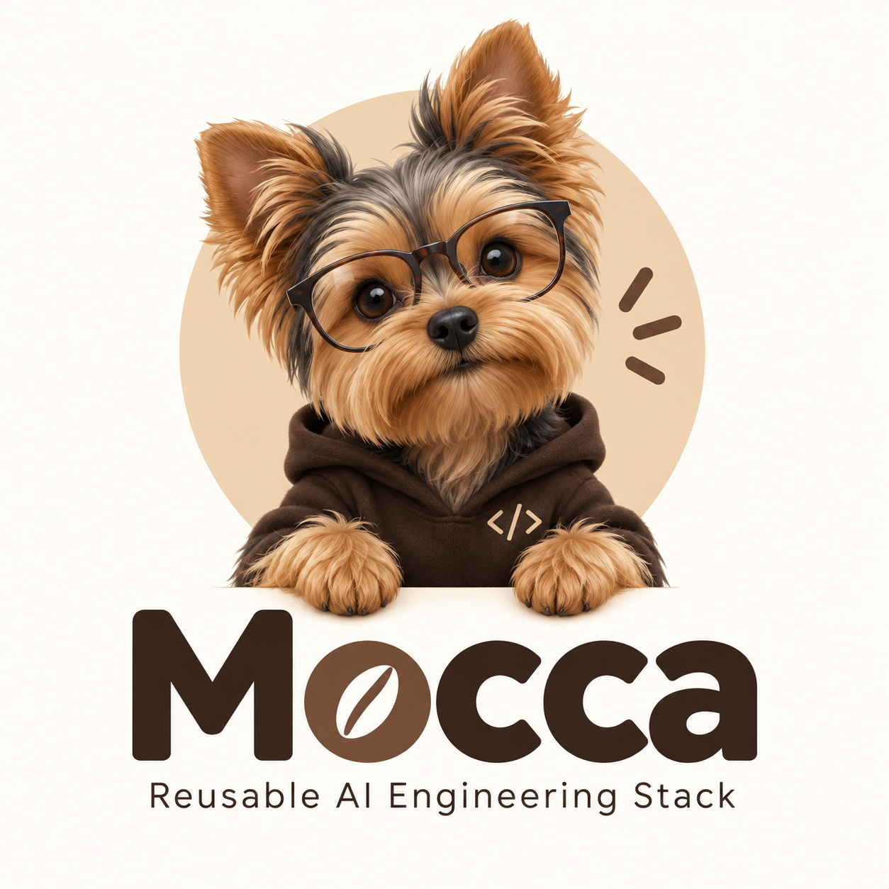

# Mocca

**Reusable Agentic Engineering Stack**

> Small footprint. Big attitude.

**Versión actual:** `v0.1 — Puppy`

*Todavía aprendiendo que no debo morder los muebles.* 🐶

[English](README.md) | Español

> Esta es una traducción para lectores humanos. `README.md` y la documentación
> inglesa enlazada son las fuentes canónicas.

<p align="center">
  
</p>

Mocca es un workspace de ingeniería ligero y con criterio para personas y
coding agents. Ayuda a definir un proyecto antes de elegir su tecnología de
implementación, para que las decisiones importantes sean explícitas y el
trabajo pueda verificarse.

**Mocca does not start technology projects. It starts engineering processes.**

Puppy cierra el Core technology-neutral y su lifecycle seguro de Profiles; el
[scope](docs/discovery.md) y los [release gates](docs/requirements.md)
normativos definen lo que falta antes del release.

## Inicio rápido

Clona Mocca y crea un workspace technology-neutral:

```sh
git clone https://github.com/omaryesith/mocca-stack.git
cd mocca-stack

./scripts/bootstrap ../my-project
cd ../my-project
./scripts/verify
```

Abre tu coding-agent harness y comienza con:

```text
I want to build a software project.

The idea is:

<describe the idea here>

Use this workspace to guide the project from this idea to an
implementation-ready specification.

Ask only what you need to resolve relevant ambiguity.
```

Mocca guía el proyecto por discovery, specification, decisiones aprobadas y
preparación para implementación.

### Empezar con un engineering environment ya conocido

Core puro es el camino por defecto: no se seleccionan lenguaje, framework,
base de datos, container stack ni product source tree.

Si una persona ya seleccionó explícitamente un engineering environment, puede
aplicar Profiles respaldados por Catalog durante bootstrap:

```sh
./scripts/bootstrap ../my-project \
  --profiles python-django
```

Los Profiles preparan el engineering environment aprobado. No generan,
seleccionan ni preforman el product source tree.

`--profiles` representa una selección humana explícita. Dentro de un workspace
existente, aplica un Profile seleccionado mediante el applicator canónico:

```sh
./scripts/apply-profile --profiles python-django
```

## Qué es Mocca

Mocca crea un workspace de ingeniería preparado para agentes antes de que un
proyecto se convierta en una aplicación. Ofrece a personas y agentes un lugar
compartido para intención, decisiones, límites, specifications y verificación
determinista.

Existe porque la capacidad bruta de un agente puede llevar a supuestos sin
acuerdo, decisiones tecnológicas prematuras, arquitectura implícita y código
plausible sin evidencia suficiente.

Mocca intencionalmente no es:

- un application framework;
- un project starter o product generator;
- un agent runtime;
- un workflow engine u orchestration platform;
- un reemplazo para un framework, coding harness o tooling determinista.

Technology follows requirements.

## Cómo funciona

```text
idea
→ discovery
→ requirements and clarification
→ technology selection
→ architecture and ADRs
→ implementation specification
→ implementation
→ verification
```

El workspace tiene cuatro Engineering States globales:

```text
DISCOVERY → SPECIFICATION → IMPLEMENTATION_READY → IMPLEMENTATION
```

Estos hacen descubribles desde el workspace el trabajo permitido, los límites
de aprobación y los criterios de cierre. Consulta la [guía de workflow](templates/core/docs/workflow.md)
generada para el lifecycle y la semántica de estados.

El lifecycle de Profiles se mantiene separado de Engineering State:

```text
Approved capabilities
→ local Profile Catalog
→ compatible Profile
→ human selection
→ remote fetch
→ validation
→ Profile Application
→ Applied Profiles
```

El Catalog contiene metadata local; el payload de un Profile seleccionado de
forma explícita se obtiene bajo demanda desde una source fijada a un commit SHA
inmutable. Consulta [Profile Catalog Contract v1](docs/profile-catalog-contract-v1.md)
para el detalle.

## Conceptos centrales

Mocca Core es technology-neutral. Es dueño del proceso de ingeniería reusable,
no de un application stack preferido.

- **Engineering State** declara la fase global actual y evita process drift sin
  instrucciones repetidas en prompts.
- **Project Pulse** sólo está activo durante `IMPLEMENTATION`; registra foco
  actual y progreso observable por checkpoints. No es un backlog ni un project
  manager.
- **Implementation practice** favorece Spec-Driven Development, test-first
  para comportamiento razonablemente testeable, checkpoints verticales y
  cierre respaldado por verification.
- **Product layout** usa `app/` como default para una aplicación simple. Otro
  layout es válido cuando la arquitectura aprobada o la convención del stack lo
  justifica.
- **Autonomy** se mantiene limitada por scope aprobado y consequential decision
  gates. Autonomy is earned through verification.

El lifecycle detallado, la semántica de Pulse, las reglas de layout y la
práctica de implementación viven en la [guía de workflow](templates/core/docs/workflow.md).

## Profiles

Los Profiles son capability packs declarativos, opcionales y composables. Core
incluye metadata local en el Catalog; los payloads compatibles se obtienen bajo
demanda después de una selección humana desde sources fijadas a commit SHAs
inmutables.

> Profiles prepare the approved engineering environment. They must not create,
> select, or pre-shape the product source tree.

La aplicación normal ocurre en `IMPLEMENTATION_READY` mediante
`scripts/apply-profile`. Los Profiles no generan application scaffolds.

Profiles disponibles:

| Profile | Engineering environment | No añade |
| --- | --- | --- |
| `python-django` | Python, Django, `uv`, `pyproject.toml`, baseline de lint/testing | `app/`, `manage.py`, models, views, routes, auth o product behavior |

Consulta [Profile Contract v1](docs/profile-contract-v1.md) para seguridad y
composición del payload, y [Profile Catalog Contract v1](docs/profile-catalog-contract-v1.md)
para discovery y sources fijadas. La [guía de Profiles](profiles/README.md) es
el punto de partida para Profiles disponibles y futuros.

## Chef's Recommendation

Mocca es technology-neutral, pero no carece de criterio. Mapea
responsabilidades a implementaciones preferidas sin convertirlas en
dependencias conceptuales.

| Responsabilidad | Recomendación actual |
| --- | --- |
| Agent harness | Codex |
| Engineering discipline | Ponytail |
| Codebase intelligence | Graphify |
| Spec-driven workflow | GitHub Spec Kit |
| Documentación actual de librerías | Context7 |
| Contexto de repositorio | GitHub MCP, cuando aporte valor |
| Operational environment | Docker, cuando aporte valor concreto |
| Confidence and autonomy | Deterministic verification y bounded autonomy |

> Mocca cares about responsibilities, not brands.

Las integraciones MCP son opt-in. Usa una capability recomendada sólo cuando
el harness activo la expone y mejora materialmente la responsabilidad actual;
de lo contrario usa el Core fallback de Mocca. Bootstrap no instala ni inspecciona
ninguna. Core sigue funcionando sin Ponytail, Graphify, Spec Kit, Context7 o
MCPs; Mocca no afirma haber usado una capability inexistente ni la provisiona.

Docker es recomendado cuando aporta valor operacional, no es requerido por
Core, Bootstrap, Discovery ni Specification. Si no está disponible, sólo
bloquea una operación que realmente requiere Docker; Mocca nunca instala,
provisiona ni modifica el host. Su futura materialización pertenece a un
Profile opcional, no a Core.

## Dogfooding

Mocca desarrolla Mocca. Su propia visión, scope, constraints, constitución,
decisiones, autonomía y contrato de verification usan el mismo enfoque que
recomienda a workspaces generados.

Si ese proceso se vuelve pesado, confuso, repetitivo o impráctico mientras se
construye Mocca, es evidencia de que ese diseño pertenece fuera de Core.

> Mocca should be comfortable living in its own dog house.

> Eat your own dog food. Guard your own house.

El espíritu Yorkie es pequeño, enfocado, valiente y serio con los límites. Los
[Yorkie Principles](docs/constitution.md) autoritativos gobiernan el desarrollo
de Mocca.

## Mapa de documentación

| Necesidad | Leer |
| --- | --- |
| Yorkie Principles | [Constitution](docs/constitution.md) |
| Lifecycle, Engineering State, Pulse, layout e implementation practice | [Workflow](templates/core/docs/workflow.md) |
| Límites de aprobación y autonomía | [Autonomy policy](docs/autonomy.md) |
| Contrato de verification de Mocca | [Verification](docs/verification.md) |
| Seguridad y composición del payload de Profiles | [Profile Contract v1](docs/profile-contract-v1.md) |
| Availability de Profiles y remote sources fijadas | [Profile Catalog Contract v1](docs/profile-catalog-contract-v1.md) |
| Capability fallbacks y postura de Docker | [Integrations](templates/core/docs/integrations.md) |
| Uso o autoría de Profiles | [Profiles guide](profiles/README.md) |
| Capas y extension boundary de Mocca | [Architecture overview](docs/architecture/overview.md) |
| Qué pertenece a una implementation-ready spec | [Specs guide](templates/core/specs/README.md) |

Los workspaces generados contienen sus propias instrucciones operacionales en
`AGENTS.md`, `MOCCA.md`, `docs/` y `specs/`.

## Desarrollar Mocca

Mocca se verifica con:

```sh
./scripts/verify
```

Mantén el Core pequeño. Extiende mediante Profiles o project-local skills antes
de cambiar Core; un límite universal y duradero necesita evidencia demostrada y
un ADR.

Mocca no necesita pesar 40 kg para cuidar la casa.
